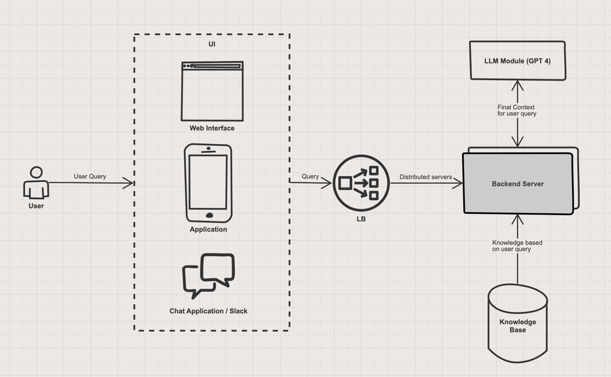
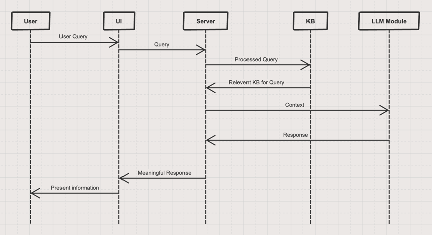

# Design Document

## Architecture


#### **User Interface (UI):**
Technology Options: Web-based (React, Vue.js), Mobile (Flutter, React Native), Chat Platforms (Slack, Discord).

#### **Backend Server/API Layer:**
Technology Options: Java (Spring-Boot), Node.js, Python (Flask, Django).

#### **(NLP) Module:**
Technology Options: OpenAI's GPT-4 API, LLM

#### **Knowledgebase:**
Technology Options: SQL/NoSQL databases (PostgreSQL, MongoDB).

## Data Flow


#### **User Query**: 
User submits a question via the UI.

#### **API Request**: 
The frontend sends an API request to the backend with the user query.

#### **NLP Processing / At Server**:
- Tokenization
- Intent Recognition
- Entity Extraction

#### **Knowledgebase Query**: 
Backend queries the knowledgebase using extracted information.

#### **Response Generation / LLM**: 
Constructs a meaningful response based on retrieved data.

#### **API Response**: 
Backend sends the response back to the frontend.

#### **Display**: 
UI presents the response to the user.

## Technology Stack
#### Frontend
```
React.js
```
React is versatile, has a large community, and integrates well with various backend services.

#### Backend
```
Python with Flask or Django
```
Python has robust NLP libraries and is well-suited for rapid development. Spring-Boot as well another option as it easily deployable and secure, object-oriented. 

#### NLP 
```
OpenAI GPT-4 API
```
GPT-4 offers advanced language understanding and generation capabilities, reducing the need for extensive model training.

#### Database
```
MongoDB
```
Flexible schema design ideal for knowledgebases that may evolve over time.

### Deployment
```
Docker & AWS or Azure
```
Docker ensures consistency across environments, while AWS & Azure provides scalable infrastructure.

## API Design

####  POST /api/query
Accepts user queries.
Request Body:
```json
{
  "user_id": "string",
  "query": "string"
}
```
Response:
```json
{
  "response": "string"
}
```

#### GET /api/health
Health check for the API.
Response:
```json
{
  "status": "OK"
}
```

#### More implementation:
- **Authentication**: Implement API keys or OAuth for secure access.
- **Rate Limiting**: Prevent abuse by limiting the number of requests per user/IP.
- **Logging**: Track requests and responses for monitoring and debugging.

## Error Handling

#### Invalid Input
Validate user queries for emptiness or inappropriate content.
```
Inform the user about the invalid input and request rephrasing.
```

### NLP Processing Failures
Catch exceptions during NLP processing.
```
Send a generic apology message and log the error for further investigation.
```

### Knowledgebase Unavailability:
Monitor database connectivity.
```
Notify the user of temporary unavailability and log the issue.
```

### API Rate Limits Exceeded:
Track the number of API calls.
```
Inform the user to try again later.
```

### Unhandled Exceptions:
Implement global exception handlers.
```
Provide a fallback message and log the stack trace.
```